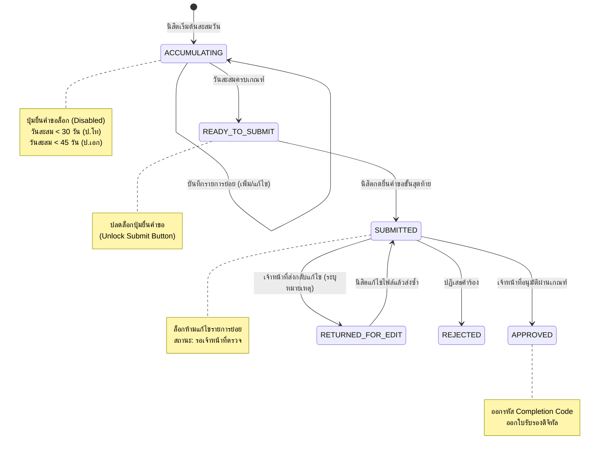
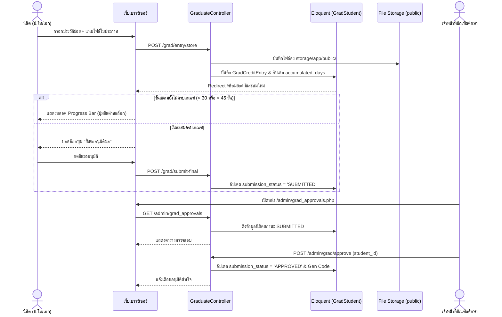

# Technical Architecture & Flow (`architecture.md`)
## Feature: Graduate Meditation Credit & Approval System (`graduate`)
**สถาปัตยกรรมระบบสำหรับ Laravel 11 Framework บน Apache 2.4 / PHP 8.4**

---

### 1. โครงสร้างไฟล์ในระบบ (Laravel 11 Architecture Structure)

```
mcuvms-laravel/
├── app/
│   ├── Http/
│   │   ├── Controllers/
│   │   │   ├── GraduateController.php        # จัดการ Portal ฝั่งนิสิต (ค้นหา, บันทึกวัน, ยื่นคำขอ)
│   │   │   └── AdminController.php           # จัดการ Admin Console (อนุมัติ, ตีกลับแก้ไข, ออกรายงาน)
│   │   └── Middleware/
│   │       └── EnsureAdminAuthenticated.php  # ป้องกันเส้นทาง Admin
│   ├── Models/
│   │   ├── GradStudent.php                   # Eloquent Model: โปรไฟล์นิสิต ป.โท/เอก
│   │   ├── GradCreditEntry.php               # Eloquent Model: ประวัติการเข้าปฏิบัติธรรมย่อย
│   │   ├── OrganizationUnit.php              # Eloquent Model: 52 ส่วนงานทั่วประเทศ
│   │   └── User.php                          # Eloquent Model: เจ้าหน้าที่และผู้ดูแลระบบ
│   └── Services/
│       └── GraduateCreditService.php         # Business Logic: คำนวณวัน, Lock Engine, Gen Completion Code
├── database/
│   ├── migrations/
│   │   ├── 2026_09_23_000001_create_organization_units_table.php
│   │   ├── 2026_09_23_000003_create_grad_students_table.php
│   │   └── 2026_09_23_000004_create_grad_credit_entries_table.php
│   └── seeders/
│       └── DatabaseSeeder.php                # ข้อมูลเริ่มต้น 52 ส่วนงาน และตัวอย่างนิสิต ป.โท/เอก
├── resources/
│   └── views/
│       ├── portal/
│       │   └── grad_progress.blade.php       # หน้าแดชบอร์ดสะสมวันนิสิต (Earth Tones & Lucide)
│       └── admin/
│           ├── grad_approvals.blade.php      # หน้าตรวจสอบและอนุมัติผลสะสมวัน
│           └── grad_review_detail.blade.php  # หน้าจอ Split-Screen Reviewer
└── routes/
    └── web.php                               # ประกาศ Route แบบ Clean และ Legacy .php
```

---

### 2. Route Mapping (การจับคู่เส้นทาง URL)

| URL (Clean Route) | URL (Legacy Compatibility) | Method | Controller & Action | วัตถุประสงค์ |
| :--- | :--- | :---: | :--- | :--- |
| `/grad_progress` | `/grad_progress.php` | `GET` | `GraduateController@progress` | หน้าแดชบอร์ดค้นหาและตรวจสอบวันสะสมของนิสิต |
| `/grad/entry/store` | `/grad_entry_store.php` | `POST` | `GraduateController@storeEntry` | บันทึกประวัติการปฏิบัติธรรมย่อยพร้อมไฟล์แนบ |
| `/grad/submit-final` | `/grad_submit_final.php` | `POST` | `GraduateController@submitFinal` | ยื่นคำขออนุมัติขั้นสุดท้าย (เมื่อวันครบ 30/45 วัน) |
| `/admin/grad_approvals` | `/admin/grad_approvals.php` | `GET` | `AdminController@gradApprovals` | หน้าตรวจสอบรายการคำขอที่รออนุมัติ |
| `/admin/grad/approve` | `/admin/grad_approve.php` | `POST` | `AdminController@approveGrad` | อนุมัติผลและออกรหัสรับรองดิจิทัล |
| `/admin/grad/reject` | `/admin/grad_reject.php` | `POST` | `AdminController@rejectGrad` | ส่งกลับให้นิสิตแก้ไขพร้อมระบุเหตุผล |

---

### 3. State Machine & Data Flow Diagram

#### 3.1 การเปลี่ยนสถานะของคำขอ (State Machine)



#### 3.2 เวิร์กโฟลว์การทำงานในระบบ Laravel (Data Flow Sequence)


