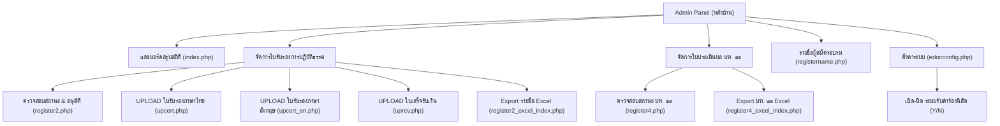

# เอกสารพจนานุกรมข้อมูลและรายละเอียดทุกฟิลด์ (Data Dictionary & Field Specifications)
**สถาบันวิปัสสนาธุระ มหาวิทยาลัยมหาจุฬาลงกรณราชวิทยาลัย (มจร)**

---

## 📑 สารบัญ
1. [ระบบที่ 1 : ระบบขอเอกสารและใบรับรอง e-Document (หน้าบ้าน)](#1-ระบบที่-1--ระบบขอเอกสารและใบรับรอง-e-document)
2. [ระบบที่ 2 : ระบบลงทะเบียนอบรมคอร์สวิปัสสนากรรมฐาน (หน้าบ้าน)](#2-ระบบที่-2--ระบบลงทะเบียนอบรมคอร์สวิปัสสนากรรมฐาน)
3. [ระบบที่ 3 : ระบบจัดการหลังบ้าน e-Document (Admin Back-office)](#3-ระบบที่-3--ระบบจัดการหลังบ้าน-e-document-admin-back-office)
   - [3.1 โครงสร้างเมนูและการทำงานของหลังบ้าน](#31-โครงสร้างเมนูและการทำงานของหลังบ้าน)
   - [3.2 ฟิลด์และฟังก์ชันการจัดการคำร้อง (`admin/register2.php`)](#32-ฟิลด์และฟังก์ชันการจัดการคำร้อง-adminregister2php)
   - [3.3 ระบบอัปโหลดเอกสารตอบกลับ (`upcert.php`, `uprcv.php`)](#33-ระบบอัปโหลดเอกสารตอบกลับ)
   - [3.4 ระบบตั้งค่าเปิด-ปิดระบบ (`edocconfig.php`)](#34-ระบบตั้งค่าเปิด-ปิดระบบ)
4. [การวิเคราะห์ความสอดคล้องระหว่าง "หน้าบ้าน" และ "หลังบ้าน" (Alignment & Consistency Analysis)](#4-การวิเคราะห์ความสอดคล้องระหว่าง-หน้าบ้าน-และ-หลังบ้าน)
5. [ข้อสังเกตและแนวทางยกระดับระบบ (Recommendations)](#5-ข้อสังเกตและแนวทางยกระดับระบบ)

---

## 1. ระบบที่ 1 : ระบบขอเอกสารและใบรับรอง e-Document
* **ไฟล์ต้นทาง:** `edoc/register.php` (ใบรับรอง) และ `edoc/register3.php` (ใบประเมิน บฑ. ๒๑)
* **Form Name / ID:** `<form name="data_form" id="data_form" method="post" enctype="multipart/form-data">`

### 1.1 หมวดไฟล์เอกสารแนบและหลักฐาน
* `file` (`picpath`): รูปถ่ายนิสิต ขนาด 2x2 นิ้ว พื้นหลังสีฟ้า
* `file2` (`picpath2`): ไฟล์ PDF ใบบันทึกการส่ง-สอบอารมณ์กรรมฐาน
* `file3` (`picpath3`): ไฟล์ PDF ใบลงเวลาปฏิบัติกรรมฐาน
* `file4` (`picpath4`): รูปถ่ายสลิปหลักฐานการโอนเงินค่าธรรมเนียม
* `sdatepickert`: วันที่โอนเงิน
* `timet`: เวลาที่โอนเงิน

### 1.2 หมวดข้อมูลส่วนตัวและประวัติผู้ยื่นคำร้อง
* `txt_studentid`: รหัสนิสิต (Max: 15)
* `txt_titlename`: คำนำหน้าชื่อ (มี Event `onclick="getData()"`)
* `txt_name` - `txt_lastname`: ชื่อ - นามสกุล
* `txt_buddhistname`: ฉายาทางธรรม (ถ้าไม่มีใส่ `-`)
* `txt_age`: อายุ (ตัวเลข 2 หลัก)
* `txt_vassa`: พรรษา (ตัวเลข 2 หลัก)
* `txt_personalid`: เลขประชาชน 13 หลัก หรือ Passport
* `txt_nation`: สัญชาติ (Default: `ไทย`)

### 1.3 หมวดข้อมูลการศึกษาและสังกัดใน มจร
* `txt_faculty`: คณะ (พุทธศาสตร์, ครุศาสตร์, มนุษยศาสตร์, สังคมศาสตร์, บัณฑิตวิทยาลัย, IBSC)
* `txt_subject`: สาขาวิชา
* `txt_status`: ระดับการศึกษา (`BA` ตรี, `MA` โท, `PHD` เอก, `ANO` อื่นๆ)
* `txt_another`: ระบุระดับการศึกษาอื่น ๆ
* `txt_zone`: วิทยาเขต / วิทยาลัยสงฆ์ / หน่วยวิทยบริการ (รวม 48 แห่งทั่วประเทศ)
* `txt_degree`: หลักสูตรปริญญา (ประกาศนียบัตร, มหาบัณฑิต, ดุษฎีบัณฑิต)

### 1.4 หมวดข้อมูลที่อยู่และการติดต่อ
* `txt_address` - `txt_province`: ที่อยู่ครบชุด (บ้านเลขที่, หมู่, ถนน, ตำบล, อำเภอ, จังหวัด)
* `txt_postcode`: รหัสไปรษณีย์ 5 หลัก
* `txt_tel`: หมายเลขโทรศัพท์มือถือ

### 1.5 หมวดข้อมูลการปฏิบัติธรรมและเจ้าหน้าที่
* `sdatepicker` - `edatepicker`: วันที่เริ่ม - สิ้นสุดการปฏิบัติธรรม
* `txt_amount`: จำนวนช่วง (Period)
* `txt_total`: รวมจำนวนวัน (Days)
* `txt_staff_name` / `txt_staff_tel`: ชื่อและเบอร์โทรเจ้าหน้าที่ผู้รับผิดชอบ

---

## 2. ระบบที่ 2 : ระบบลงทะเบียนอบรมคอร์สวิปัสสนากรรมฐาน
* **ไฟล์ต้นทาง:** `vi/register.php` (เปิดจาก `vi/course.php`)
* **Form Name / ID:** `<form name="data_form" id="data_form" method="post">`
* `hid_pid` / `hid_pjid`: รหัสคอร์ส/โครงการ
* `txt_status`: สถานะผู้สมัคร (หากเลือก `PEOPLE` ประชาชนทั่วไป จะ Auto-set `txt_studentid`='0', `txt_faculty`='NOFAC', `txt_subject`='-')
* `txt_titlename`, `txt_name`, `txt_lastname`, `txt_buddhistname`
* `txt_age`: อายุ (ตัวเลข > 5)
* `txt_vassa`: พรรษา (ตัวเลข ถ้าไม่มีใส่ 0)
* `txt_personalid`: เลขบัตร ปชช. / Passport (ตัวเลข >= 8 หลัก)
* `txt_tel`, ที่อยู่ครบชุด, `txt_postcode` (5 หลัก)
* `txt_room`: ข้อมูลห้องพัก / อาคาร
* `txt_car`: ยานพาหนะ / ทะเบียนรถ

---

## 3. ระบบที่ 3 : ระบบจัดการหลังบ้าน e-Document (Admin Back-office)
* **URL:** `https://plan-vipassana.mcu.ac.th/vi/edoc/admin/index.php`
* **ผู้ดูแลระบบปัจจุบัน:** พระมหาแสงตะวัน ขนฺติเมธี (`sangtawan.khan@mcu.ac.th`)
* **ผู้ออกแบบ/เขียนโปรแกรม:** พระครูภาวนาวรบัณฑิต วิ. , พระสิทธิชัย ธมฺมโชโต

### 3.1 โครงสร้างเมนูและการทำงานของหลังบ้าน

---

### 3.2 ฟิลด์และฟังก์ชันการจัดการคำร้อง (`admin/register2.php`)
เป็นหน้าจอหลักที่เจ้าหน้าที่ใช้ตรวจสอบคำร้องที่นิสิตส่งเข้ามาจากหน้าบ้าน:

#### 1) ระบบค้นหาและตัวกรอง (Search & Filters)
แอดมินสามารถเลือกค้นหาได้ 9 มิติ (`rdo_perid`):
* `value="8"` : **วันที่ขอเอกสาร** (ระบบกำหนดค่าเริ่มต้นเป็นวันปัจจุบัน เช่น `2026-09-29`)
* `value="1"` : **รหัสนิสิต** (`txt_studentid`)
* `value="2"` : **เลขประจำตัวประชาชน** (`txt_personalid`)
* `value="3"` : **ชื่อ-นามสกุล** (`txt_name`)
* `value="7"` : **ระดับการศึกษา** (`txt_status` : BA / MA / PhD)
* `value="4"` : **คณะ** (`txt_faculty`)
* `value="5"` : **สาขาวิชา** (`txt_subject`)
* `value="9"` : **สถานะเอกสาร**
* `value="6"` : **แสดงทั้งหมด**

#### 2) ตารางแสดงผลข้อมูล (Data Columns)
ข้อมูลที่ระบบหลังบ้านดึงมาแสดงผลในแต่ละแถว ประกอบด้วย:
1. **วันที่ขอ:** วันและเวลาที่ส่งคำร้องเข้ามา
2. **รูปภาพและหลักฐานแนบ:** แสดงรูปถ่ายนิสิต, ลิงก์เปิดไฟล์ PDF ใบบันทึกสอบอารมณ์, ลิงก์เปิดไฟล์ PDF ใบลงเวลา
3. **ข้อมูลนิสิต:** คำนำหน้า, ชื่อ, นามสกุล, ฉายา, รหัสนิสิต, ระดับการศึกษา, คณะ, สาขาวิชา, วิทยาเขต, ที่อยู่, เบอร์โทรศัพท์
4. **ค่าธรรมเนียม:** รูปภาพสลิปโอนเงิน พร้อมวันที่และเวลาที่ระบุในสลิป
5. **สถานะและการจัดการ:**
   * ปุ่มเปลี่ยนสถานะเอกสาร (`changeStatus(id)`) เรียก AJAX ไปที่ `classes/change_docstatus.php` เพื่อปรับสถานะเป็นอนุมัติ/ผ่าน
   * ปุ่มยกเลิกคำร้อง (`changeStatusCancel(id)`) เรียก AJAX ไปที่ `classes/change_docstatus_cancel.php` เพื่อลบคำร้องที่ไม่ถูกต้องออกจากระบบ

---

### 3.3 ระบบอัปโหลดเอกสารตอบกลับ
หลังบ้านมีระบบส่งไฟล์กลับไปให้นิสิตดาวน์โหลด:
* **`upcert.php` (ใบรับรองภาษาไทย):** แอดมินเลือกนิสิตและอัปโหลดไฟล์ PDF ใบรับรองที่ลงนามแล้ว
* **`upcert_en.php` (ใบรับรองภาษาอังกฤษ):** สำหรับหลักสูตรนานาชาติหรือนิสิตที่ขอฉบับภาษาอังกฤษ
* **`uprcv.php` (ใบเสร็จรับเงิน):** อัปโหลดไฟล์ใบเสร็จรับเงินค่าธรรมเนียม เพื่อให้นิสิตไปดาวน์โหลดผ่านหน้าตรวจสอบสถานะ (`register2.php` หน้าบ้าน)

---

### 3.4 ระบบตั้งค่าเปิด-ปิดระบบ (`admin/edocconfig.php`)
* **ฟิลด์:** `txt_status` (Dropdown)
  * `Y` = เปิดระบบรับคำร้อง (Open)
  * `N` = ปิดระบบรับคำร้อง (Close)
* มีผลควบคุมหน้าแบบฟอร์มหน้าบ้าน ไม่ให้นิสิตส่งคำร้องนอกช่วงเวลาที่กำหนด

---

## 4. การวิเคราะห์ความสอดคล้องระหว่าง "หน้าบ้าน" และ "หลังบ้าน"

| มิติการตรวจสอบ | รายละเอียดความสอดคล้อง | ผลการประเมิน |
| :--- | :--- | :---: |
| **1. โครงสร้างฟิลด์ข้อมูล (Data Schema)** | ทุกฟิลด์ที่หน้าบ้านให้นิสิตกรอก (รหัส, ชื่อ, ฉายา, วุฒิ, คณะ, สาขา, วิทยาเขต, ที่อยู่, วันที่ปฏิบัติ) ถูกส่งเข้าฐานข้อมูลและหลังบ้านดึงมาแสดงผลในตาราง `register2.php` ครบถ้วน 100% | ✅ **สอดคล้องกันสมบูรณ์** |
| **2. ไฟล์หลักฐานและสลิป (Attachments)** | ไฟล์ทั้ง 4 รายการ (รูปนิสิต, สอบอารมณ์, ลงเวลา, สลิปโอนเงิน) ที่อัปโหลดจากหน้าบ้าน ถูกเชื่อมโยงมาให้แอดมินเปิดดูและตรวจสอบได้โดยตรงในตารางหลังบ้าน | ✅ **สอดคล้องกันสมบูรณ์** |
| **3. เงื่อนไขการค้นหา (Filter Alignment)** | ตัวเลือกค้นหา 9 แบบในหลังบ้าน (รหัสนิสิต, บัตร ปชช., ชื่อ, คณะ, สาขา, วุฒิการศึกษา) สอดคล้องกับฟิลด์ที่หน้าบ้านบันทึก ช่วยให้เจ้าหน้าที่ค้นหาเอกสารของนิสิตได้รวดเร็ว | ✅ **สอดคล้องกันสมบูรณ์** |
| **4. สถิติ Dashboard** | แดชบอร์ดสรุปยอดผู้ยื่นคำร้องแยกตามกลุ่ม ป.ตรี (BA: 143), ป.โท (MA: 6,338), ป.เอก (PhD: 2,981) สอดคล้องกับค่าตัวเลือก `txt_status` ในหน้าฟอร์มรับสมัคร | ✅ **สอดคล้องกันสมบูรณ์** |
| **5. การเชื่อมโยง 2 ระบบ (Cross-system Link)** | ในหลังบ้าน e-Doc มีเมนู `registername.php` เพื่อดูรายชื่อผู้สมัครอบรมจากระบบคอร์สหน้าบ้าน (`vi/course.php`) ทำให้แอดมินสามารถตรวจสอบความเชื่อมโยงของผู้มาอบรมกับการขอใบรับรองได้ | ✅ **สอดคล้องกันสมบูรณ์** |

---

## 5. ข้อสังเกตและแนวทางยกระดับระบบ (Recommendations)

1. **ระบบการออกใบรับรองอัตโนมัติ (Automated Certificate Generator):**
   * ปัจจุบันหลังบ้านใช้วิธี **อัปโหลดไฟล์ใบรับรองทีละไฟล์ด้วยมือ (`upcert.php`)** หากมีผู้ยื่นจำนวนมาก (เช่น ป.โท 6,000+ รายการ) เจ้าหน้าที่จะมีภาระงานสูงมาก
   * **ข้อเสนอแนะ:** สามารถเขียนโปรแกรมสร้างไฟล์ PDF ใบรับรองอัตโนมัติ (Dynamic PDF Template) โดยดึงข้อมูล ชื่อ-ฉายา, วันที่อบรม, และเล่มที่/เลขที่ใบรับรองจากฐานข้อมูล พร้อมแทรกภาพลายเซ็นดิจิทัลและ QR Code เพื่อตรวจสอบความแท้จริงได้ทันที
2. **ระบบแจ้งเตือนสถานะคำร้อง (Notification System):**
   * ปัจจุบันนิสิตต้องคอยเข้ามาเช็กเองที่หน้า `register2.php`
   * **ข้อเสนอแนะ:** เมื่อเจ้าหน้าที่กดปุ่มเปลี่ยนสถานะใน `change_docstatus.php` ให้ระบบส่งอีเมลแจ้งเตือนไปยังอีเมลของนิสิต (เช่น `...@mcu.ac.th`) พร้อมแนบลิงก์ดาวน์โหลดใบรับรอง
3. **การปรับปรุงความปลอดภัยของไฟล์อัปโหลด (Upload Security):**
   * ควรเพิ่มการตรวจสอบนามสกุลไฟล์ ขนาดไฟล์ (File Size Limit) และสแกนไวรัสฝั่งเซิร์ฟเวอร์ เพื่อป้องกันการอัปโหลดสคริปต์อันตราย
